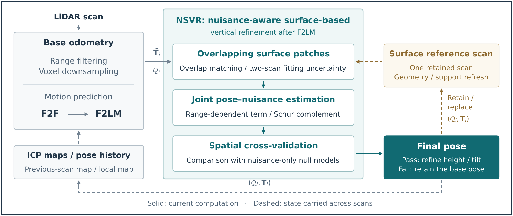
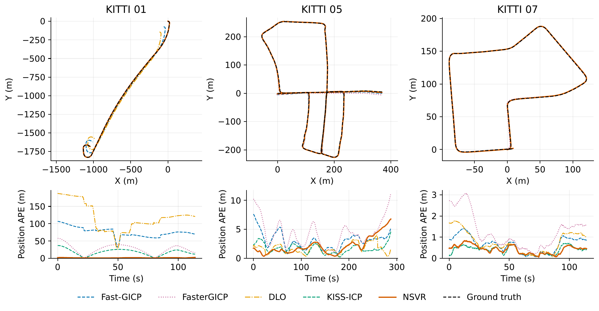

# NSVR LiDAR Odometry

**Surface-constrained vertical refinement with nuisance elimination for LiDAR-only odometry.**

Reference implementation accompanying the manuscript **Surface-Constrained Vertical
Refinement and Nuisance Elimination-Based LiDAR Odometry**.

[Demo](#four-sequence-mapping-replay) · [Method](#method) · [Results](#paper-results) · [Build](#build-and-test) ·
[Run](#run) · [Evaluation](#position-evaluation-and-timing)

> Publication status: prepared for submission to *IEEE Transactions on Vehicular
> Technology*. This repository does not imply acceptance or an ongoing review.

NSVR combines motion-predicted two-stage registration with selective height and
tilt refinement. This repository contains the C++ implementation, the final
KITTI and M2DGR configuration files, lightweight run/evaluation tools, and
synthetic regression tests.

## Four-sequence mapping replay

https://github.com/user-attachments/assets/cbf88f71-be8b-450c-b9d1-18fba68e870e

**KITTI 00 and 02 · M2DGR Hall01 and Room01 · 1080p / 24 fps / 28 seconds.**
Each panel is generated from the corresponding final NSVR trajectory and original
LiDAR scans. Point clouds accumulate in temporal order; orange lines show the
estimated trajectories, and cyan markers show the current poses. All four source
runs contain every input scan.

The video uses accelerated, normalized sequence progress; the original
evaluations used 1.0x recorded-speed playback. Cloud subsampling and fixed camera
framing are for visualization only, without re-estimating or smoothing poses.

[Download MP4](docs/media/nsvr_four_sequence_demo.mp4) ·
[View poster](docs/media/nsvr_four_sequence_poster.png) ·
[Rendering details and reproduction](docs/demo.md)

## Method

The pipeline combines frame-to-frame (F2F) and frame-to-local-map (F2LM)
registration with surface-based vertical refinement. The refinement profiles out
a per-pair nuisance parameter, checks held-out surface support, and reuses a
geometrically selected single-acquisition reference. It uses LiDAR points only;
no IMU, ground truth, external gravity estimate, or loop closure is used online.



**Registration → surface observations → nuisance elimination → spatial validation.**
The base pose is retained if the surface correction is not supported. The
previous-scan map, local ICP map, and retained surface reference have separate
roles. [Download the vector flowchart](docs/media/pipeline.pdf).

## Trajectory and error comparison



The figure uses the final KITTI runs reported in the manuscript: sequences
**01, 05, and 07**. The upper row shows aligned trajectories, and the lower row
shows three-dimensional position APE over recording time. It is a trajectory
comparison, not a point-cloud mapping replay. No additional smoothing or
plot-specific alignment is applied.
[Download the vector comparison](docs/media/kitti_trajectories.pdf).

## Paper results

| Evaluation | NSVR result |
| --- | ---: |
| KITTI 00–10, sequence-average position APE RMSE | **2.211 m** |
| KITTI 00–10, sequence-average APE Mean / Std | **1.967 / 0.991 m** |
| KITTI, mean algorithm time / P95 | **42.01 / 60.34 ms** |
| KITTI, pooled throughput | **23.81 Hz** |
| KITTI, RMSE without / with the complete vertical module | **3.821 / 2.211 m** |
| M2DGR, seven-sequence average position APE RMSE | **0.608 m** |

These are recorded manuscript results, not measurements from an installation
test. KITTI timing uses an Intel Core i5-14600K CPU, 32 GB RAM, Release builds,
and 20 configured worker threads. The method has the lowest average position
APE RMSE among the evaluated methods on both reported subsets; this is not a
claim that it is the fastest or best on every sequence. M2DGR errors describe
ground-truth-supported portions, including partial coverage on Door01 and
Lift01. See the evaluation section below for timing and association details.

## Build and test

The reference environment is Ubuntu 20.04, ROS Noetic, GCC 9.4, and CMake 3.16.
The standalone CMake build needs C++17, ROS `rosbag`, `roscpp`, `sensor_msgs`,
Eigen3, and TBB. Python tools need the ROS Python packages, PyYAML, and NumPy.
Sophus 1.22.11 and robin-map 1.2.1 are fetched with pinned archive SHA256 hashes
at configure time, so the first configuration needs network access. PCL and a
running ROS master are not required.

With ROS Noetic installed, the additional Ubuntu packages are:

```bash
git clone https://github.com/qfwang23/NSVR-LiDAR-Odometry.git
cd NSVR-LiDAR-Odometry
sudo apt install build-essential cmake libeigen3-dev libtbb-dev python3-yaml python3-numpy
source /opt/ros/noetic/setup.bash
cmake -S . -B build -DCMAKE_BUILD_TYPE=Release -DPYTHON_EXECUTABLE=/usr/bin/python3
cmake --build build -j2
cmake -E chdir build ctest --output-on-failure
PYTHONDONTWRITEBYTECODE=1 /usr/bin/python3 -B -m unittest discover -s tests -v
```

The C++ tests cover geometry, centered updates, voxel search, and surface
validation. Python tests check provenance, configurations, timing, position
metrics, output protection, and all four variants using a tiny temporary
synthetic ROS bag. No dataset download or benchmark replay is needed for tests.

## Inputs and paper configurations

Keep datasets outside this repository. Each input is a ROS1 bag named
`<sequence>.bag`, containing little-endian `sensor_msgs/PointCloud2` messages on
`/velodyne_points`, with FLOAT32 `x`, `y`, `z` fields and strictly increasing
header timestamps. Finite native XYZ points are used without additional sensor
rotation or motion deskewing. The repository does not distribute datasets or
convert raw KITTI scans into bags.

| Configuration | KITTI | M2DGR |
| --- | --- | --- |
| File | `config/kitti.yaml` | `config/m2dgr.yaml` |
| Near/far range | 5 / 100 m | 1 / 100 m |
| Map voxel edge | 1.0 m | 0.6 m |
| Points per voxel | 15 | 15 |
| Initial adaptive threshold | 2.0 m | 2.0 m |
| Minimum motion threshold | 0.1 m | 0.1 m |

KITTI uses sequences `00` through `10`. The seven-sequence M2DGR subset is
`room_01`, `hall_01`, `door_01`, `lift_01`, `street_03`, `street_04`, and
`street_05`. Each dataset uses one shared configuration; these are the paper
profiles, including the **0.6 m** M2DGR voxel size.

## Run

Use a new output directory for every command. The runner supplies every YAML
parameter explicitly and verifies the frozen core hashes. Full runs require a
committed, clean Git checkout; a smoke run can also use an unpacked source tree.

```bash
# Full KITTI profile: all 11 sequences, serial playback, 20 worker threads.
/usr/bin/python3 scripts/run_dataset.py \
  --config config/kitti.yaml --data-root /path/to/KITTI \
  --output /path/to/new-kitti-full --variant full --threads 20

# Full M2DGR profile: all seven sequences.
/usr/bin/python3 scripts/run_dataset.py \
  --config config/m2dgr.yaml --data-root /path/to/M2DGR \
  --output /path/to/new-m2dgr-full --variant full --threads 20

# Short input/installation check only; not a paper accuracy or timing result.
/usr/bin/python3 scripts/run_dataset.py \
  --config config/m2dgr.yaml --data-root /path/to/M2DGR \
  --sequence room_01 --output /path/to/new-smoke \
  --variant full --threads 20 --max-frames 120
```

For the vertical-module ablation, change `--variant full` to
`--variant no_vertical` and choose a different output directory. `no_f2f` and
`neither` are also available; all variants retain motion prediction and F2LM.
Use `--sequence 00` or another configured sequence for a single full sequence.
The binary itself has no `--config` flag; use the runner or supply all numeric
parameters shown by `build/lo_bag --help`.

Playback follows bag-recorded timestamps at fixed 1.0x speed. Late processing
drains all scans without dropping them. This is serial bag playback, not a
separate ROS publisher/subscriber queue experiment. The adapter has an 8 GiB
virtual-address-space limit. Outputs are only `run.json` and per-sequence
`trajectory.tum`, `timing.csv`, and `run.log`; no point clouds, output bags, or
global visualization maps are saved.

## Position evaluation and timing

For a completed sequence, supply a text GT trajectory with timestamp and XYZ
columns; TUM's remaining quaternion columns are accepted but not used for GT
position evaluation. The estimate is an eight-column TUM trajectory.

```bash
/usr/bin/python3 scripts/evaluate_run.py \
  --dataset kitti --sequence 00 --variant full \
  --run /path/to/new-kitti-full/00 \
  --ground-truth /path/to/KITTI/gt_correct00.txt --expected-frames 4541
```

Set `--expected-frames` to the complete input count recorded in `run.json`.
For M2DGR, use `--dataset m2dgr`, the selected sequence name, and its GT file.
Evaluation writes `metrics.json` and `position_errors.csv` beside the sequence
outputs. It checks complete finite poses, unit estimate quaternions, timestamps,
variant flags, and timing integrity before reporting results.

APE uses position-only SE(3) alignment with unit scale. KITTI requires one GT row
per estimate with timestamps agreeing within 0.1 ms. M2DGR uses linear position
interpolation without crossing detected GT gaps and reports the associated-pose
coverage; partial GT coverage must remain visible when results are summarized.
Large ECEF-like GT coordinates are translated for numerical conditioning only.
No sensor-origin/extrinsic transformation is performed. The physical reference
point and original conversion provenance of the paper's supplied GT files were
not established by the local records; this package does not supply or infer them.

- `algorithm_ms` is the paper timing boundary: native XYZ conversion of an
  already-deserialized message through the completed pose and reference/map
  update. It excludes bag I/O, deserialization, playback waiting, and file I/O.
- `pipeline_ms` covers `RegisterFrame`, excluding native XYZ conversion.
- `processing_ms` additionally includes message instantiation/deserialization;
  it is not interchangeable with `algorithm_ms` or sensor-to-consumer latency.
- `registration_ms`, `f2f_ms`, `f2m_ms`, and `vertical_surface_ms` are diagnostic
  stage timings, not the primary total latency.

The evaluator reports all-frame timing and timing after excluding the first two
frames. For paper-style pooled throughput, sum the remaining frame counts and
divide by the sum of their `algorithm_ms` values, multiplying by 1000; do not
average per-sequence Hz. Accuracy is not warmup-trimmed. Hardware and thread
settings affect measured speed; synthetic and shortened runs do not establish
the paper's benchmark results.

## License and acknowledgments

The authors' contributions are released as open-source software under the
[MIT License](LICENSE). Portions of the inherited base odometry descend from
[KISS-ICP](https://github.com/PRBonn/kiss-icp); their original MIT copyright and
permission notice is preserved in [LICENSES/KISS-ICP-MIT.txt](LICENSES/KISS-ICP-MIT.txt).
See [THIRD_PARTY_NOTICES.md](THIRD_PARTY_NOTICES.md) for the file-level provenance
mapping, the fixed Sophus and robin-map dependency notices, and the distinction
between source-release and binary-distribution obligations. Third-party code
and dataset terms are not replaced by this repository's license.
